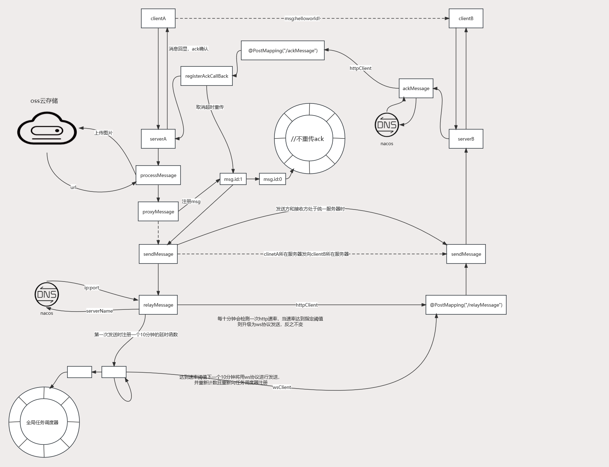

# 基于Netty-SocketIo框架的IM聊天室

### 开发环境
- Idea2023
- Java8
- SpringBoot
- Netty-SocketIo
- Redis
- Hazelcast
- MySQL
- Vue 
- Vuex 
- Typescript
### 项目说明
在遨游B站时看到有人在介绍genaller大佬的im聊天室项目，看到前端是十分对胃口，但是对于后端缺少对于集群的支持，所有萌生用java重构后端并提供集群支持，再之后这个项目就诞生了。

### 功能介绍
- 移动端兼容
- 用户信息的修改(头像/密码)
- 群聊/私聊
- 创建群/加入群/退群/模糊搜索群
- 添加好友/删好友/模糊搜索用户
- 消息分页
- 表情包
- 图片发送/图片预览
- 自定义主题
- 后端集群化部署
- 消息集群间传递
- 图片集群间传递
### 项目原理
#### 发送消息原理图

图片详细https://www.processon.com/v/65100371efc2276ceeba7e6f 
    

#### ACK
1.前端发后后端会接收到数据且创建一个ack回调并将ack回调注册到时间轮中如果指定之间时间轮的定时任务没被取消则会进行重发直到3次为止且向前端反馈发送失败。
2.如果消息需要进行集群内转发，则在转发后目标client接收到消息后执行回调，会调用全局ack函数，函数底层实现了集群内转发。    
3.发送方所在服务器接收到消息后取消时间轮的调度任务，且给自身发送一个消息进行消息回显表示发送成功。
4.消息的ack同样借鉴了tcp的Ack思想，不重传ack只重传请求，得益于该思想屏蔽了很多细节降低了开发的难度，但是细粒度不高重传时会造成一定程度的浪费但是这一部分浪费是可以接受的。
#### 集群间转发
1.将每一个服务端同时看作一个客户端，进行消息转发，所有服务端在启动时会向注册中心进行注册，此时注册中心的作用类似dns同时也起到了在线检测的作用
2.服务端在查询到目标服务器的ip:port后会调用httpClient转发，由于http是基于TCP的短链接每次的消息发送都需要进行3次握手和4次挥手，同时服务端之间的消息转发量是很大的如果一个消息握手挥手用到了5ms那1000条消息转发则用到了5000ms这一部分的开销很明显是没必要的
3.如果一开始就用到tcp长连接即ws有需要维持心跳发送进行保活检测在多集群情况下数据量小的情况下这部分花销也是不必要的
4.综合上述两种情况，在进行消息转发的时候同时引入了全局任务调度和计数统计
5.每10分钟进行一次速率统计如果每分钟的速率达到了1000阈值则进行协议切换，并且进行统计清零重新放入任务调度器延迟10分钟。
#### 消息存储
1.借鉴了TimeLine模型所有消息保持序号保证严格递增
2.离线消息存储的是离线时说接收到的最后一条消息的序号
3.上线时间只需要读取最新序号到离线时所在的序号
4.避免离线消息过多进行一个限制对离线消息读取限制在100条内，采用推拉结合的方式在用户前端触发读取下一页历史消息的再进行拉取
5.在线消息进行不直接到库而是放入rabbitMq，进行异步入库
#### 缓存架构
1.采用了分布式缓存Hazelcast,得益于Hazelcast的Java集合Api实现，降低了上手难度。
2.Hazelcast采用的是分片存储，去中心化，当任意一台服务器宕机时缓存数据并不会丢失。
3.用到Hazelcast内嵌结构不需要另外的软件，直接引入依赖可用，但是缺陷在于没有对于nacos服务注册发现的支持后续要自行实现。
### 计划功能
* [ ] 加密群组
* [ ] 管理员后台
* [ ] 更方便的与现有项目集成方式
* [ ] 敏感词过滤
* [ ] 全平台消息推送
* [ ] 群成员聚集在宏观上进行聚集将群内好友或者好友之间处于一台服务器上，减少集群间消息转发的数量降低发送消息延迟
下一个目标：全平台消息推送，主要是client端离线时将消息推动到绑定的平台。

由于个人前端知识的局限性质很多想法没有能很好的实现出来，如将消息分成为在线消息、离线消息、漫游消息，前端上线时去离线消息库拉取消息并进行展示，拉去ack确认后删除离线库消息转为漫游消息。采用推拉结合的方式解决了写扩散的问题。

### 特别感谢
前端是基于[Genal](https://github.com/genaller)的[genal-chat](https://github.com/genaller/genal-chat)（阿童木聊天室）二次开发的

*** 对他表示诚挚的感谢🙏 ***
